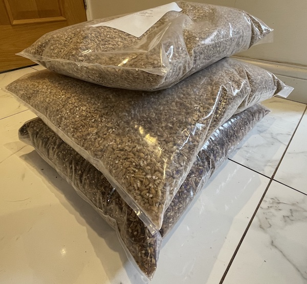
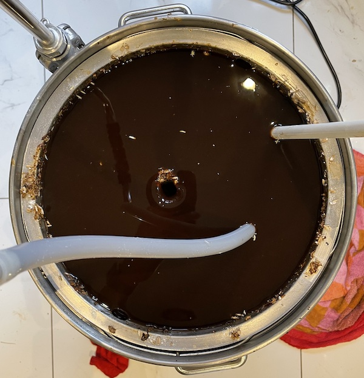
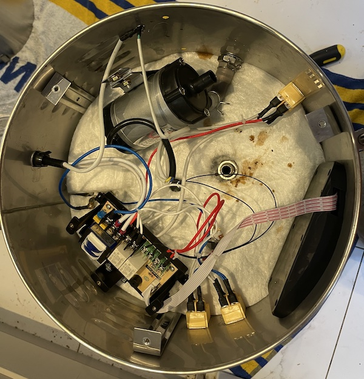
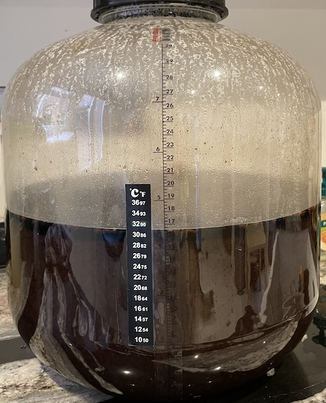
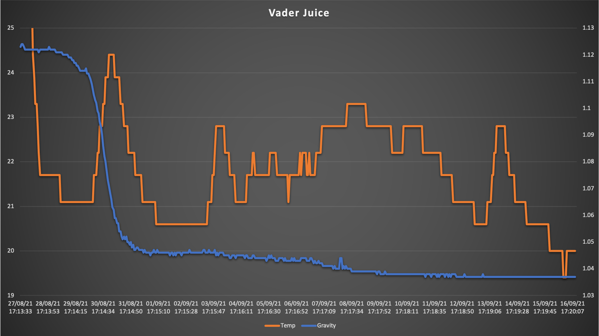
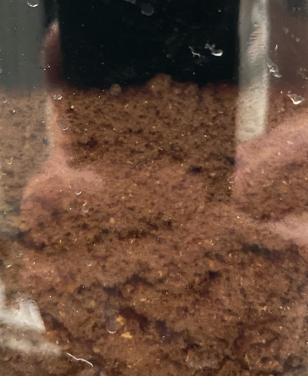
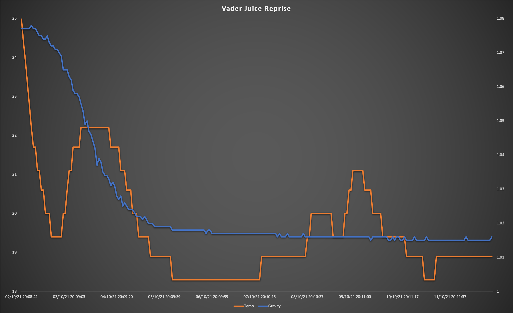
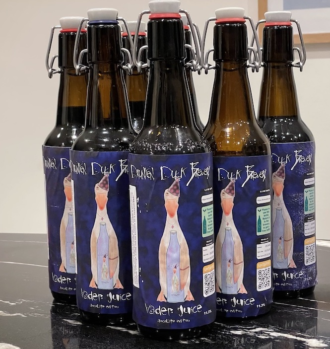

# Vader Juice

## Ingredients

For a 25 litre batch, as at [Malt Miller](https://www.themaltmiller.co.uk/rg/?id=226090)

| Grain                           | Quantity |
| ------------------------------- | -------- |
| Crisp extra pale maris otter    | 7000g    |
| Weyermann CaraAroma             | 1000g    |
| TMM malted toasted wheat flakes | 1000g    |
| Simpsons crystal extra dark     | 750g     |
| Crisp dark munich malt          | 500g     |
| Dingemans biscuit malt          | 500g     |
| crisp chocolate malt            | 500g     |
| Weyermann carafa special type 3 | 250g     |
| Weyermann carafa special type 1 | 250g     |

From [Grainfather](https://shop.grainfather.com/brewing-calculators)

* Mash water: 30 litres
* Sparge water: 11 litres

| Additions                      | Quantity | Time         |
| ------------------------------ | -------- | ------------ |
| Magnum hops                    | 75g      | 90           |
| Belgian Candi sugar rocks dark | 500g     | 30           |
| Saaz hops                      | 25       | 10           |
| Yeast 1084 Irish Ale           |          | Fermentation |

## Estimates

From [brewers friend](https://www.brewersfriend.com)

| OG    | FG    | Calories      | ABV  | IBU  | SRM  | Attenuation |
| ----- | ----- | ------------- | ---- | ---- | ---- | ----------- |
| 1.113 | 1.029 | 353 per 330ml | 11%  | 73   | 50   | 73%         |

## Process

It sounds so simple does it. Just add the water and malt, steep, boil, add hops, cool, ferment, drink. what could go wrong?

This is why I have a lessons learnt section, i'm here to learn from my mistakes so i can make a better beer next time. My main mistake was being greedy. I usually like to make 10 litre batches, but couldn't decide what adjuncts to add to this beer so instead opted to make a lot more and split it into batches. My boiler has a 35 litre capacity, so it should be easy to make 25 litres of beer.

It wasn't until brew day that I calculated how much water to add to my 11kg of grain. 30 litres! 30 litres of water and 11kg of grain does not fit into a 35 litre mash. I've actually concluded that I can't get more than 7kg of grain into my pipe, but if it want it to free flow then I really shouldn't consider adding more than 5kg. 

As this clearly wasn't going to work I split the mash into 2 parts, one with 7kg and one with 4kg. with the 7kg of grain I only got 24l of water for mashing.

And thats where the second mistake happened. As the malt pipe was so full for the first mash, I didn't put the top plate in place. This resulted in grain falling to under the pipe, and blocking the filter at the bottom making the pump struggle to move the fluid. In fact it got so bad that the pump actually started sucking liquid in reverse, also bringing some grain with it and blocking the plumbing completely. Suffice to say, I am now well versed in brewzilla disassembly. 

What actually happened is that I mashed 7kg in 24l of water for 60 minutes, sparged with 2l, swapped grain for a second batch of 4kg, mashed again for an hour and sparged with another 2l of water, taking time for a 75C 10 minute mash out after each mash. As the pump was blocked I stirred constantly with my spoon so vigorously that it snapped in half. 

After the boil I was left with 17 litres of fluid with an OG of 1.223.

## Process checklist

- Activate yeast
- clean brewzilla with Stellarclean
- Add 24l of water
- add crusted campden tablet
- raise to 65C
- use false bottom, bottom plate and top plate.
- add 7kg of grain
- mash for 60 minutes
- prepare boiler
  - clean boiler with stellarclean
  - boil 10l of water
- raise malt pipe
- raise temperate to 75C
- sparge with 2l water at 75C
- replace spent grain with second batch
- steep at 65C for 60 minutes
- raise malt pipe raise temperature to 75C
- sparge with 2l water at 75C
- raise to 100C
- boil for 60 minutes
- Add magnum hop at start
- add candi at 30 minutes
- Add saaz hops 10 minutes from end
- Add 5g irish moss 5 minutes from end.
- chill in place to 25C
- transfer to fermenter
- pitch yeast

## Fermentation

As I was making a large batch I got a new fermenter, a fermzilla. You get a good view of the the beer, and the airlock shows a nice smooth breath from the beer. 

<video src="breath.mp4"></video>

Frustratingly it took 48 hours before the gravity started to drop. I spent a day convinced that i'd killed the yeast but it seemed to finally kick in. At least that was the case until the SG dropped to 1.046 where it sat for a week. I felt this was slightly too high a FG for a beer as I didn't want it to be too sweet so pitched some CL23 Mangrove Jacks premium wine yeast. I know, this isn't very precise but i wanted wanted some beer to survive at this stage.

## Actual figures

| Field       | Target         | Actual |
| ----------- | ------------- | ---------- |
| OG          | 1.113        |1.123|
| FG          | 1.029      |1.037|
| ABV         | 11.0%      |11.3%|
| Attenuation | 73%        |70%|

## Graph

## Barrelling

The photo below was taken just after adding the beer to the fermenter. It shows than due to the lack of grain filter during mashing, some detritus made it through to the fermenter. Although it settled over time, only 6l of beer was successfully siphoned off for barreling. This was rather disappointing, but some beer is better than none. Importantly, it tasted gorgeous: rich, heavy and smooth. Exactly what I was aiming for.

## Further Experimentation

I took the decision to treat this as a research batch. After barrelling I added 25g of cocoa nibs to the barrel. I know that putting chocolate in a beer is slightly naughty but I wanted to see if this would ruin it completely, or if it would even dissolve over time. After a month the chocolate hadn't fully dissolved but did add a subtle chocolate flavour. pouting carefully is recommended.

A second experiment to try with the remains of this beer is eisbocking. 2l were added you a water pouch and added to the freezer. I suspect there's an art to eisbocking in getting the temperature correct to maximise the water reduction. 24 hours just led to a beer slushy, but 8 hours barely had any freezing. 16 hours seemed about the right time to drain sufficient beer off whilst leaving some slush behind. In an ideal world the remains would be pure white ice crystals to help make the ANV calculations easy, but they were relatively dark. I don't know how strong the eisbock is but the tongue suggests this has an some impact on the final strength. Further reading suggests freezing at just below 0C is the best temperature to eisbock at. One to try when i have a brewing fridge with a good temperature range.

# Vader Juice mk 2

Although a lot went wrong with this brew, the final product (what little there was of it) tasted great which was motiviation enough to try again, but this time with much smaller proportions.

## Ingredients

For a 10 litre batch, as at [Malt Miller](https://www.themaltmiller.co.uk/rg/?id=232939)

| Grain                           | Quantity |
| ------------------------------- | -------- |
| Crisp extra pale maris otter    | 2800g    |
| Weyermann CaraAroma             | 400g     |
| TMM malted toasted wheat flakes | 400g     |
| Simpsons crystal extra dark     | 300g     |
| Crisp dark munich malt          | 200g     |
| Dingemans biscuit malt          | 200g     |
| crisp chocolate malt            | 200g     |
| Weyermann carafa special type 3 | 100g     |
| Weyermann carafa special type 1 | 100g     |

From [Grainfather](https://shop.grainfather.com/brewing-calculators)

* Mash water: 16 litres
* Sparge water: 3 litres

| Additions                                        | Quantity | Time         |
| ------------------------------------------------ | -------- | ------------ |
| Magnum hops                                      | 30g      | 90           |
| Belgian Candi sugar rocks dark                   | 200g     | 30           |
| Saaz hops                                        | 10g      | 10           |
| ALLEMAND Nottingham - High Performance Ale Yeast | 11g      | Fermentation |

## Estimates

From [brewers friend](https://www.brewersfriend.com)

| OG    | FG    | Calories      | ABV  | IBU  | SRM  | Attenuation |
| ----- | ----- | ------------- | ---- | ---- | ---- | ----------- |
| 1.113 | 1.021 | 375 per 330ml | 12%  | 94   | 50   | 81%         |

## Process

This went a lot better. I assembled the mash tun correctly and used it without any blockages or explosions. A textbook brew. I also used some [lipohop](https://www.themaltmiller.co.uk/product/nbs-lipohop-k-15g/) in an attempt to control foaming during the boil. The water calculations from brewers friend were almost perfect, although I has to add an additional 2l of water during the mash to cover the grain, and even that that wasn't enough. Not given the grain space to properly move led to a very inefficient mash.

## Actual Figures

| Field       | Target         | Actual |
| ----------- | ------------- | ---------- |
| OG          | 1.113        |1.077|
| FG          | 1.021      |1.015|
| ABV         | 12.0%      |8%|
| Attenuation | 81%        |79%|

## Graph

## Barrelling

The beer was into 2 barrels for secondary conditioning. One with 50g of lactose sugar and a chopped up vanilla pod to give a hint of advocat, and one with 20g whisky infused wood chips to give the barrel aging flavour. These are both experiments to see how well they work.

Given that the barrel isn't the final destiantion for these beers it makes sense to replace the air with CO2 or NO2 (for the advocat and whiksy variants respectively) so that the beer has less to react with.

## Lessons learnt

* Add lipohop during the mash out - it takes a while to get going. 
* Having since spoken to a real brewer, splitting a brew into 2 mashes when volumes is an issues is perfectly reasonable, it's called reiteration mashing.
* Reiteration mashing is preferable to too much grain in the pipe, this leads to low efficiency. however reiteration has it's own inefficiencies to worry about. Alternatively additional water can always be boiled off. Next time I need to do this I shall have to plan carefully.
* Do not put too much grain in the pipe.
* Do not forget to add filters.

# Bottling

Putting the label in portrait allows for a differnt duck, but they don't quite fit. I may reseve this style for anything over 10% - the tall duck acts as a warning to others.

